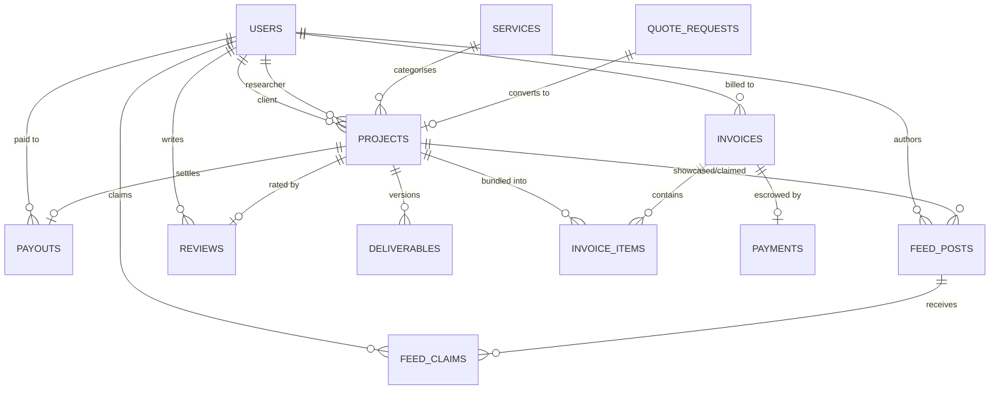

# 01 · Database Schema Outline

> **Wulweth Research & Publishing — managed research marketplace**
> Relational model for identities, engagements, money movement (escrow → payout),
> QC artifacts, the public feed and reviews. Runtime dialect: SQLite (`db/schema.sql`).
> Production dialect: PostgreSQL (DDL below) — the shapes are identical.

---

## 1. Entity-relationship overview

```
users ──1:N── projects (as client)
  │  ──1:N── projects (as researcher)
  │  ──1:N── invoices (as client)
  │  ──1:N── payouts  (as researcher)
  │  ──1:N── feed_posts (as author)
  │  ──1:N── reviews
  │  ──M:N── feed_posts  (via feed_claims)
  │
services ──1:N── projects
projects ──1:N── deliverables        (version-controlled submissions)
projects ──1:1── payouts             (one settlement per project)
projects ──1:1── reviews             (one review per project)
projects ──1:N── invoice_items ──N:1── invoices
invoices ──1:1── payments            (escrow ledger entry per invoice)
quote_requests ──0:1── projects      (public brief → converted project)
```

Mermaid (renderable on GitHub):



---

## 2. Table-by-table outline

### `users` — clients, researchers, admins (single-table with role)
| column | type | notes |
|---|---|---|
| id | text PK | `usr_…` |
| name / email / password_hash | text | bcrypt cost ≥ 10; email unique |
| role | enum | `CLIENT \| FREELANCER \| ADMIN` |
| headline, bio | text | researcher profile |
| disciplines | text[] (PG) / CSV (SQLite) | drives **expertise matching** |
| affiliation, orcid | text | credential verification |
| verified | bool | the **vetted researcher** trust badge |

### `services` — the research-only catalog + fee engine
| column | notes |
|---|---|
| slug / name / tagline / description | public catalog content |
| category | `Publication \| Analysis \| Thesis & Academia \| Data & Visualization` |
| from_price_cents, eta_days | advertised "from" price & turnaround |
| **fee_mode, fee_value** | company take-rate: `PERCENT` (0–90) or fixed cents — editable in Admin → Fee Management; snapshotted at payout time |

### `projects` — the engagement
| column | notes |
|---|---|
| tracking_id | `WRP-2026-XXXXX` — client-facing unique ID |
| client_id, researcher_id | FK → users (researcher nullable until matched) |
| service_id, discipline, title, description | scope |
| status | `PENDING → QUOTED → ASSIGNED → IN_PROGRESS → UNDER_REVIEW → COMPLETED → PAID_OUT` (+`CANCELLED`) |
| budget_cents / agreed_cents | client indication vs desk-quoted price |
| deadline | drives SLA indicators |

**Status machine (transitions enforced in code):**

```
PENDING ──(admin prices)──► QUOTED ──(invoice paid → escrow)──► QUOTED
   │                                                        │
   └──(admin matches)──► ASSIGNED ──(researcher starts)──► IN_PROGRESS
                                ▲                            │
                                │                     (submits vN)
                          (QC: revision)              UNDER_REVIEW
                                                             │
                                          (QC: approve) COMPLETED ──(payout)──► PAID_OUT
```

### `quote_requests` — public "Get a Quote" intake (guests included)
`ref` (`WRP-Q-…`), contact fields, discipline, details, budget, deadline, `status NEW→CONVERTED`,
`project_id` link. Admin conversion provisions a client account if the email is unknown.

### `invoices` + `invoice_items` — quote → invoice → bundle
- One **invoice** per client with N **items**; each item references **at most one project**
  (UNIQUE on `invoice_items.project_id`) — this is the "invoice for my project bundle".
- `status DRAFT → ISSUED → PAID` (+`VOID`), `number` `WRP-INV-2026-0001`.

### `payments` — the escrow ledger (1:1 with invoices)
- `method CARD | BANK_TRANSFER`, `status ESCROWED → RELEASED` (+`REFUNDED`), gateway `reference`.
- **ESCROWED** = platform holds funds (Stripe: funds on platform balance).
- **RELEASED** = payout executed to the researcher (Stripe: `transfers.create`).
- Invariant enforced in code: a payout may only be triggered when an `ESCROWED`
  payment exists and QC has approved — the platform never pays from uncollected funds.

### `deliverables` — version-controlled QC artifacts
`project_id`, `version` (per-project increment), `filename`, `stored_name` (S3 key),
`mime`, `size_bytes`, researcher `note`, `status SUBMITTED → APPROVED | REVISION_REQUESTED`,
`reviewer_note`. Newest version is the active one; QC decisions are immutable history.

### `payouts` — company → researcher settlement (1:1 with projects)
`gross_cents` (= agreed price), `fee_cents` (service fee **snapshot**), `net_cents`,
`status PROCESSING → PAID`, `reference` (Stripe transfer id in production).
Snapshots make the take-rate auditable even after fee settings change.

### `feed_posts` + `feed_claims` — the company feed
- `type ANNOUNCEMENT | TREND | JOB | COMPLETED_PROJECT`, `published` (draft state),
  `anonymized` flag for showcases, optional `project_id` (job or showcase link).
- `feed_claims` (UNIQUE post+user) — a researcher claiming a `JOB` is auto-assigned
  when the linked project is unassigned (first claim wins).

### `reviews` — client satisfaction (1:1 with projects)
`rating 1–5`, `comment`. Feeds matching and (anonymized) public showcase.

---

## 3. PostgreSQL production DDL (abridged)

```sql
CREATE TYPE user_role        AS ENUM ('CLIENT','FREELANCER','ADMIN');
CREATE TYPE project_status   AS ENUM ('PENDING','QUOTED','ASSIGNED','IN_PROGRESS',
                                      'UNDER_REVIEW','COMPLETED','PAID_OUT','CANCELLED');
CREATE TYPE invoice_status   AS ENUM ('DRAFT','ISSUED','PAID','VOID');
CREATE TYPE payment_status   AS ENUM ('ESCROWED','RELEASED','REFUNDED');
CREATE TYPE deliverable_status AS ENUM ('SUBMITTED','APPROVED','REVISION_REQUESTED');
CREATE TYPE payout_status    AS ENUM ('PROCESSING','PAID');
CREATE TYPE feed_post_type   AS ENUM ('ANNOUNCEMENT','TREND','JOB','COMPLETED_PROJECT');
CREATE TYPE fee_mode         AS ENUM ('PERCENT','FIXED');

CREATE TABLE users (
  id            uuid PRIMARY KEY DEFAULT gen_random_uuid(),
  name          text NOT NULL,
  email         citext NOT NULL UNIQUE,
  password_hash text NOT NULL,
  role          user_role NOT NULL,
  headline      text, bio text,
  disciplines   text[] NOT NULL DEFAULT '{}',
  affiliation   text, orcid text,
  verified      boolean NOT NULL DEFAULT false,
  created_at    timestamptz NOT NULL DEFAULT now()
);

CREATE TABLE services (
  id               uuid PRIMARY KEY DEFAULT gen_random_uuid(),
  slug             text NOT NULL UNIQUE,
  name             text NOT NULL,
  tagline          text NOT NULL,
  description      text NOT NULL,
  category         text NOT NULL,
  from_price_cents integer NOT NULL CHECK (from_price_cents >= 0),
  eta_days         integer,
  active           boolean NOT NULL DEFAULT true,
  sort_order       integer NOT NULL DEFAULT 0,
  fee_mode         fee_mode NOT NULL DEFAULT 'PERCENT',
  fee_value        integer NOT NULL DEFAULT 15 CHECK (fee_value >= 0)
);

CREATE TABLE projects (
  id            uuid PRIMARY KEY DEFAULT gen_random_uuid(),
  tracking_id   text NOT NULL UNIQUE,
  client_id     uuid NOT NULL REFERENCES users(id),
  researcher_id uuid REFERENCES users(id),
  service_id    uuid NOT NULL REFERENCES services(id),
  discipline    text NOT NULL,
  title         text NOT NULL,
  description   text NOT NULL,
  status        project_status NOT NULL DEFAULT 'PENDING',
  deadline      timestamptz,
  budget_cents  integer,
  agreed_cents  integer CHECK (agreed_cents IS NULL OR agreed_cents > 0),
  created_at    timestamptz NOT NULL DEFAULT now(),
  updated_at    timestamptz NOT NULL DEFAULT now()
);
CREATE INDEX ON projects (client_id, created_at DESC);
CREATE INDEX ON projects (researcher_id, status);
CREATE INDEX ON projects (status, updated_at);   -- admin work queues

CREATE TABLE quote_requests (
  id uuid PRIMARY KEY DEFAULT gen_random_uuid(),
  ref text NOT NULL UNIQUE,
  name text NOT NULL, email citext NOT NULL, organisation text,
  service_id uuid REFERENCES services(id),
  discipline text NOT NULL, details text NOT NULL,
  budget_cents integer, deadline timestamptz,
  status text NOT NULL DEFAULT 'NEW' CHECK (status IN ('NEW','CONVERTED','ARCHIVED')),
  project_id uuid REFERENCES projects(id),
  created_at timestamptz NOT NULL DEFAULT now()
);

CREATE TABLE invoices (
  id uuid PRIMARY KEY DEFAULT gen_random_uuid(),
  number text NOT NULL UNIQUE,
  client_id uuid NOT NULL REFERENCES users(id),
  status invoice_status NOT NULL DEFAULT 'DRAFT',
  subtotal_cents integer NOT NULL DEFAULT 0,
  total_cents    integer NOT NULL DEFAULT 0,
  due_date date, paid_at timestamptz,
  created_at timestamptz NOT NULL DEFAULT now()
);

CREATE TABLE invoice_items (
  id uuid PRIMARY KEY DEFAULT gen_random_uuid(),
  invoice_id uuid NOT NULL REFERENCES invoices(id),
  project_id uuid UNIQUE REFERENCES projects(id),
  description text NOT NULL,
  amount_cents integer NOT NULL CHECK (amount_cents > 0)
);

CREATE TABLE payments (
  id uuid PRIMARY KEY DEFAULT gen_random_uuid(),
  invoice_id uuid NOT NULL UNIQUE REFERENCES invoices(id),
  method text NOT NULL CHECK (method IN ('CARD','BANK_TRANSFER')),
  amount_cents integer NOT NULL,
  status payment_status NOT NULL DEFAULT 'ESCROWED',
  reference text NOT NULL UNIQUE,
  created_at timestamptz NOT NULL DEFAULT now()
);

CREATE TABLE deliverables (
  id uuid PRIMARY KEY DEFAULT gen_random_uuid(),
  project_id uuid NOT NULL REFERENCES projects(id),
  version integer NOT NULL,
  filename text NOT NULL,
  stored_name text NOT NULL,             -- S3 object key (SSE-KMS)
  mime text NOT NULL,
  size_bytes bigint NOT NULL,
  note text,
  status deliverable_status NOT NULL DEFAULT 'SUBMITTED',
  reviewer_note text,
  created_at timestamptz NOT NULL DEFAULT now(),
  UNIQUE (project_id, version)
);

CREATE TABLE payouts (
  id uuid PRIMARY KEY DEFAULT gen_random_uuid(),
  project_id uuid NOT NULL UNIQUE REFERENCES projects(id),
  researcher_id uuid NOT NULL REFERENCES users(id),
  gross_cents integer NOT NULL,
  fee_cents   integer NOT NULL CHECK (fee_cents >= 0 AND fee_cents <= gross_cents),
  net_cents   integer NOT NULL CHECK (net_cents = gross_cents - fee_cents),
  status payout_status NOT NULL DEFAULT 'PROCESSING',
  reference text NOT NULL UNIQUE,
  paid_at timestamptz,
  created_at timestamptz NOT NULL DEFAULT now()
);

CREATE TABLE feed_posts (
  id uuid PRIMARY KEY DEFAULT gen_random_uuid(),
  type feed_post_type NOT NULL,
  title text NOT NULL, body text NOT NULL,
  published boolean NOT NULL DEFAULT false,
  anonymized boolean NOT NULL DEFAULT true,
  project_id uuid REFERENCES projects(id),
  author_id uuid NOT NULL REFERENCES users(id),
  created_at timestamptz NOT NULL DEFAULT now()
);

CREATE TABLE feed_claims (
  id uuid PRIMARY KEY DEFAULT gen_random_uuid(),
  post_id uuid NOT NULL REFERENCES feed_posts(id),
  user_id uuid NOT NULL REFERENCES users(id),
  message text,
  UNIQUE (post_id, user_id)
);

CREATE TABLE reviews (
  id uuid PRIMARY KEY DEFAULT gen_random_uuid(),
  project_id uuid NOT NULL UNIQUE REFERENCES projects(id),
  client_id uuid NOT NULL REFERENCES users(id),
  rating integer NOT NULL CHECK (rating BETWEEN 1 AND 5),
  comment text NOT NULL,
  created_at timestamptz NOT NULL DEFAULT now()
);
```

---

## 4. Money-integrity invariants (enforced in code, verifiable in data)

1. **A project can only be paid out once** — `payouts.project_id` UNIQUE.
2. **Payout requires escrow** — an `ESCROWED` payment must exist; the payout sets it to `RELEASED` in the same transaction.
3. **Fee split is snapshotted** — `gross = fee + net` (CHECK constraint in PG) and `fee` reflects the service fee settings *at payout time*.
4. **A project appears on at most one invoice** — `invoice_items.project_id` UNIQUE.
5. **One payment per invoice** — `payments.invoice_id` UNIQUE (MVP; split payments are Phase 2 via `payments` 1:N).
6. **Deliverable versions are append-only** — UNIQUE `(project_id, version)`; QC decisions mutate status, never rows.

## 5. Deviations in the SQLite runtime (this MVP build)

| PostgreSQL | SQLite runtime | why |
|---|---|---|
| native ENUM types | `TEXT` + CHECK constraints | portability, no extensions |
| `uuid` | `TEXT` prefixed random ids (`prj_…`) | no extension dependency |
| `citext` | case-insensitive compare via `lower()` | — |
| `text[]` disciplines | CSV string | no array type |
| `numeric` money | integer **cents** (same as PG `integer` cents) | cents everywhere avoids float traps |

See `db/schema.sql` for the executable runtime schema and `src/lib/db.ts` for the typed
data-access layer that would be swapped for `pg`/`postgres.js` in production.
