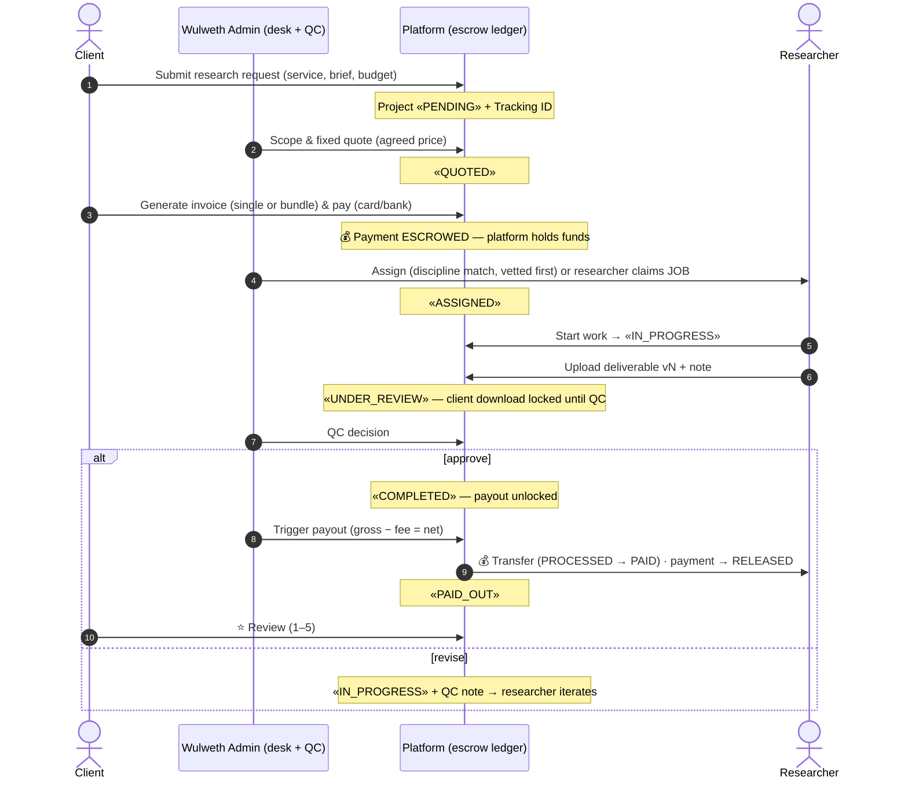

# 02 · User Flow Diagrams (text-based)

> The managed-marketplace money loop: **Client Payment → Admin Assignment →
> Freelancer Work → QC → Payout.** Plus the two intake flows (portal request and
> public quote) and the revision loop.
>
> Notation: `[role]` actor · `«state»` project status · `💰` money movement ·
> `📄` document artifact · `⛔` guard/invariant.

---

## 1. The core loop (happy path)

```
 ┌───────────────────────────────────────────────────────────────────────────┐
 │ 1. INTAKE                                                                 │
 │    [CLIENT] submits a research request in the portal                      │
 │      • service, discipline, brief, deadline, budget                       │
 │    «PENDING»  ·  tracking ID issued immediately (e.g. WRP-2026-KM74P)     │
 │      ⛔ nothing chargeable yet — no invoice exists                        │
 └───────────────────────────────┬───────────────────────────────────────────┘
                                 ▼
 ┌───────────────────────────────────────────────────────────────────────────┐
 │ 2. QUOTE                                                                  │
 │    [ADMIN] desk officer scopes the brief                                  │
 │      • sets agreed_cents (fixed price), optionally assigns researcher     │
 │    «QUOTED»  ·  price-only save = quoted, no researcher yet               │
 └───────────────────────────────┬───────────────────────────────────────────┘
                                 ▼
 ┌───────────────────────────────────────────────────────────────────────────┐
 │ 3. INVOICE & PAYMENT (escrow)                                             │
 │    [CLIENT] generates an invoice — single project or a BUNDLE of quoted   │
 │             projects on one invoice  → «WKP-INV-…» 📄                      │
 │    [CLIENT] pays: 💳 card (instant) or 🏦 bank transfer (desk-confirmed)   │
 │      💰 funds → PLATFORM CUSTODY (payments.status = ESCROWED)             │
 │      ⛔ payout blocked unless an ESCROWED payment exists                  │
 └───────────────────────────────┬───────────────────────────────────────────┘
                                 ▼
 ┌───────────────────────────────────────────────────────────────────────────┐
 │ 4. MATCHING (project dispersion)                                          │
 │    [ADMIN] assigns a researcher — roster sorted by discipline match,      │
 │            vetted-first ★  — or posts the project to the public feed      │
 │            as a JOB; [FREELANCER] claims it (first claim wins)            │
 │    «ASSIGNED»                                                             │
 └───────────────────────────────┬───────────────────────────────────────────┘
                                 ▼
 ┌───────────────────────────────────────────────────────────────────────────┐
 │ 5. WORK                                                                   │
 │    [FREELANCER] "Start work" → «IN_PROGRESS»                              │
 │      • uploads deliverable v1 (PDF/DOCX/XLSX/ZIP ≤25 MB) + version note   │
 │    📄 deliverable stored (S3/KMS in prod) · «UNDER_REVIEW»                │
 └───────────────────────────────┬───────────────────────────────────────────┘
                                 ▼
 ┌───────────────────────────────────────────────────────────────────────────┐
 │ 6. QUALITY CONTROL (two-eye principle)                                    │
 │    [ADMIN] QC desk reviews v1 against the rubric                          │
 │      ├─ APPROVED  → «COMPLETED»  (client sees download; payout unlocked)  │
 │      └─ REVISION_REQUESTED → «IN_PROGRESS» + reviewer note                │
 │              └─ loop to (5) — researcher uploads v2, v3… (append-only)    │
 └───────────────────────────────┬───────────────────────────────────────────┘
                                 ▼
 ┌───────────────────────────────────────────────────────────────────────────┐
 │ 7. PAYOUT (the split)                                                     │
 │    [ADMIN] triggers payout on a COMPLETED project with escrowed funds     │
 │      💰 gross = agreed price                                              │
 │      💰 company fee = service fee (PERCENT or FIXED) — snapshotted        │
 │      💰 researcher net = gross − fee  → payouts row «PROCESSING»          │
 │    [ADMIN] confirms settlement → «PAID», payments.status → RELEASED       │
 │    project «PAID_OUT»  ·  [CLIENT] may leave a ⭐ review                   │
 └───────────────────────────────────────────────────────────────────────────┘
```

---

## 2. Sequence view (renderable)



---

## 3. Intake flow A — signed-in client (portal)

```
/signin → [CLIENT] /portal → "New research request"
   ├─ choose service (catalog) + discipline (USP taxonomy)
   ├─ title + structured brief + deadline + indicative budget
   └─ submit → «PENDING» + Tracking ID shown on the spot
                → appears in Admin → Requests & quotes queue
```

## 4. Intake flow B — public "Get a Quote" (guests welcome)

```
/quote (public, SEO landing)
   ├─ guest fills service/discipline/brief/contact → ref WRP-Q-… 📄
   │     ⛔ no account needed — conversion provisions one
   └─ [ADMIN] /admin/requests → "Convert to project"
         ├─ price the quote (+ pick service)
         ├─ if email unknown → client account auto-provisioned (temp password)
         └─ project created «QUOTED» → invoice path (flow 1, step 3)
   ↳ signed-in clients with the same email see the brief under "My quotes"
     and can track conversion → project.
```

## 5. Open-market flow — feed jobs (claim path)

```
[ADMIN] composes JOB post (optionally linked to a funded, unassigned project)
   → published to /feed (public)
[FREELANCER] /researcher/jobs → "Claim engagement" (+ pitch)
   ├─ feed_claims row (UNIQUE per researcher)
   └─ if linked project unassigned → project.researcher_id = claimer («ASSIGNED»)
```

## 6. Bank-transfer path (non-card payment)

```
[CLIENT] pays invoice via 🏦 bank transfer
   → invoice «PAID» + payment ESCROWED immediately (demo semantics)
Production: invoice stays «ISSUED — awaiting funds» until
[ADMIN] Finance → "Confirm transfer received" → escrow funded.
(The MVP confirms instantly to keep the demo loop short; the admin
confirm action exists and is wired for the delayed-funds reality.)
```

## 7. Revision loop (QC rejection)

```
«UNDER_REVIEW» ──QC: revise (+note)──► «IN_PROGRESS»
      ▲                                      │
      └────────── researcher uploads vN+1 ───┘
Client-facing state stays "In progress"; QC note surfaces on the
researcher's dashboard so the fix is unambiguous. All versions kept.
```

## 8. Cancellation / refunds (Phase 2 wiring, modeled today)

```
[ADMIN] cancels project («CANCELLED») → any ESCROWED payment is REFUNDED
via the gateway (Stripe refund). Refund rows already exist in the ledger
enum (payments.status = REFUNDED) so finance reports stay consistent.
```

---

## 9. Who sees what (portal visibility map)

| artifact | CLIENT | FREELANCER | ADMIN |
|---|---|---|---|
| Tracking ID + status timeline | ✅ own | ✅ assigned | ✅ all |
| Brief | ✅ own | ✅ assigned | ✅ all |
| Deliverable files | ✅ own (QC-gated in UI) | ✅ own uploads | ✅ all |
| Invoice / receipt | ✅ own (printable) | — | ✅ all |
| Escrow state | ✅ own ("held by Wulweth") | implied ("funds secured") | ✅ ledger |
| Payout split | — | ✅ own (gross/fee/net) | ✅ all |
| QC notes | ✅ own (on versions) | ✅ own (actionable) | ✅ all |
| Roster & vetting badges | limited (researcher name + badge on project) | profile | ✅ manage |
